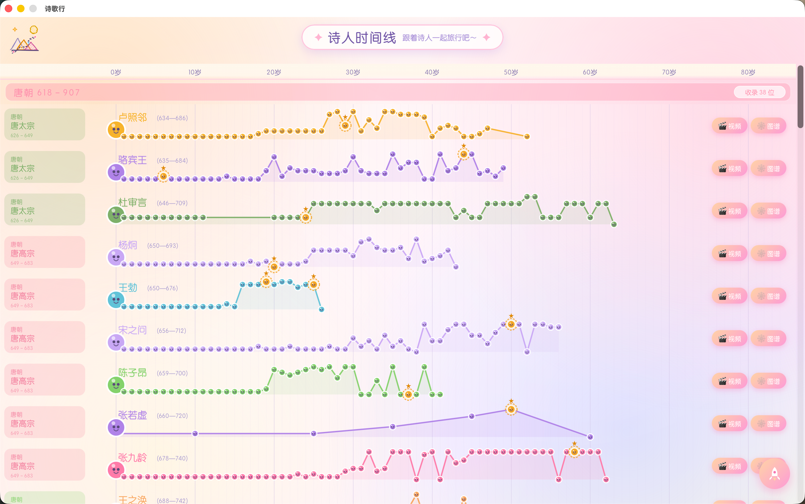

# 诗歌行

跟着诗人一起旅行。

诗歌行是一个唐宋诗人生命时间线可视化桌面应用。它以朝代为纲、年龄为轴，把诗人的生平行迹、交游关系和相关视频放在同一条时间线上，帮助你直观地感受一位诗人一生的轨迹，以及他们所处的时代。

## 功能

- **诗人时间线**：按唐、五代十国、北宋、南宋分组，每条时间线以年龄为横轴展示生平事件。
- **朝代与帝皇**：标注各朝代的起止年代与历代皇帝在位区间，作为时间线的背景参照。
- **关系图谱**：根据诗人行迹中出现的唱和、赠答、送别、举荐、师承、亲族等线索，自动生成诗人关系网络，支持聚焦某位诗人、滚轮缩放与拖拽平移。
- **视频联动**：为诗人关联 B 站视频，播放时经 Tauri 后端获取真实播放直链，无需下载视频文件。
- **名诗 3D 视图**：`public/3d` 下基于 Three.js 的名诗展示页面。

## 许可

[MIT](./LICENSE) © 2025 桔子桑
